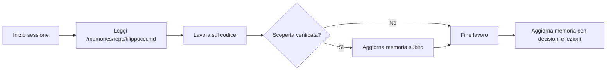

# Memoria del progetto — come leggerla e usarla

Questo documento spiega come gli agenti AI (Copilot, Claude Code, ecc.) e gli
sviluppatori devono leggere e usare la memoria associata a questo progetto.

## Dove vive la memoria

La memoria **non sta nel repo**: vive nella macchina dell'agente, sotto
`/memories/`. Ci sono tre livelli:

| Livello | Path | Contenuto | Persistenza |
| --- | --- | --- | --- |
| **Repository memory** | `/memories/repo/filippucci.md` | Fatti verificati su QUESTO progetto: architettura, sorgenti di verità, script, env vars, lavoro recente, lezioni apprese | Persistente, scoped al repo |
| **User memory** | `/memories/` | Procedure ricorrenti cross-progetto (pubblicazione Vercel, DNS Aruba, preview review) | Persistente, globale |
| **Session memory** | `/memories/session/` | Stato della conversazione in corso (piani, decisioni temporanee) | Si azzera a fine sessione |

## Come usarla

### Prima di lavorare
1. Leggi `/memories/repo/filippucci.md` per il contesto del progetto
   (architettura, convenzioni, lavoro recente, lezioni apprese).
2. Se la sessione tocca pubblicazione/infrastruttura, consulta anche la
   user memory rilevante (es. `ordyto-publish.md` per il deploy Vercel).

### Durante il lavoro
- Quando scopri un fatto verificato (comando, path, comportamento, decisione),
  **registralo subito** nella repository memory — non aspettare la fine.
- Aggiorna la memoria invece di duplicarla: se un fatto esiste già, modificalo.

### Dopo il lavoro
- Aggiorna la repository memory con: commit/decisioni prese, lezioni apprese,
  cambi di architettura, nuovi comandi utili.
- Tieni le voci brevi e puntuali (bullet points).

### Cosa NON fare
- **Non committare la memoria**: `/memories/` è fuori dal repo e non va
  inclusa nei commit.
- **Non cercare la memoria nel filesystem del progetto**: non esiste lì.
- **Non duplicare fatti** già registrati.

## Memoria nel repo (documentazione persistente)

Oltre alla memoria dell'agente, il repo contiene documentazione che funge da
memoria di design:

- `AGENTS.md` — indicazioni operative per gli agenti AI (comandi, architettura,
  convenzioni, uso della memoria).
- `README.md` — panoramica del progetto e avvio.
- Commenti in testa ai file (es. `// Orchestratore saga...`) — parte della
  memoria di design: rispettali quando modifichi il file.

## Flusso consigliato

